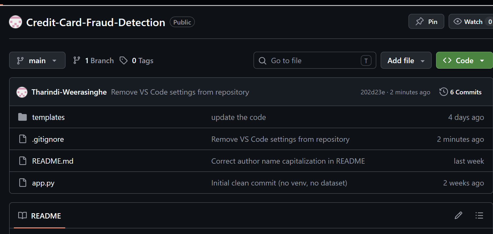
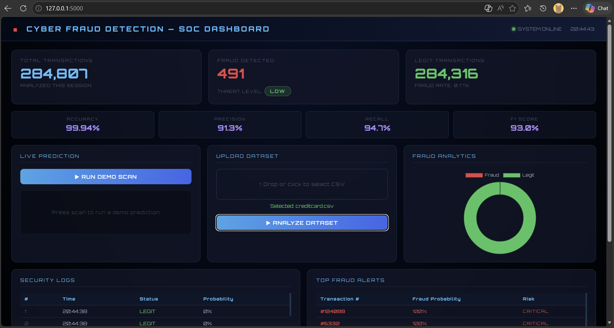

# 🛡️ Credit Card Fraud Detection Dashboard

## Overview

An AI-powered Credit Card Fraud Detection System built using Machine Learning, Flask, and Cybersecurity Analytics concepts.

This project analyzes financial transaction data and identifies potentially fraudulent transactions using a trained Random Forest Machine Learning model. The application provides a professional Security Operations Center (SOC) style dashboard for transaction monitoring, fraud analysis, security logging, and threat assessment.

---

## Project Objectives

* Detect fraudulent credit card transactions using Machine Learning
* Analyze large transaction datasets
* Visualize fraud trends and security metrics
* Demonstrate cybersecurity monitoring concepts
* Build a professional dashboard for security analytics

---

## Features

### Machine Learning Fraud Detection

* Random Forest Classifier
* Real-time prediction capability
* Fraud probability scoring
* Threat level classification

### Security Dashboard

* Cybersecurity-themed SOC dashboard
* Fraud analytics visualization
* Transaction statistics
* Threat monitoring

### Data Analysis

* CSV dataset upload
* Automatic transaction processing
* Fraud rate calculation
* Security log generation

### Analytics & Monitoring

* Fraud Detection Metrics
* Accuracy Tracking
* Precision Analysis
* Recall Analysis
* F1 Score Evaluation
* Top Fraud Alerts
* Security Event Logs

---

## Technologies Used

### Programming Language

* Python

### Machine Learning

* Scikit-Learn
* Random Forest Classifier
* Pandas
* NumPy

### Web Development

* Flask
* HTML5
* CSS3
* JavaScript

### Data Visualization

* Chart.js

### Version Control

* Git
* GitHub

---

## System Architecture

Transaction Dataset
↓
Data Preprocessing
↓
Feature Analysis
↓
Random Forest Model
↓
Fraud Prediction
↓
Threat Assessment
↓
SOC Dashboard Visualization

---

## Dataset

Dataset Used:

Kaggle Credit Card Fraud Detection Dataset

Dataset Statistics:

* Total Transactions: 284,807
* Fraudulent Transactions: 491
* Legitimate Transactions: 284,316
* Fraud Rate: 0.17%

The dataset contains anonymized transaction features and is widely used for fraud detection research.

---

## Model Performance

| Metric    | Score  |
| --------- | ------ |
| Accuracy  | 99.94% |
| Precision | 91.3%  |
| Recall    | 94.7%  |
| F1 Score  | 93.0%  |

---

## Dashboard Features

### Security Metrics

* Total Transactions
* Fraud Detected
* Legit Transactions
* Fraud Rate

### Threat Monitoring

* Threat Level Classification
* Fraud Alerts
* Security Event Logs

### Analytics

* Fraud Distribution Chart
* Dataset Analysis
* Transaction Monitoring

---

## Screenshots

### Dashboard Home



### Fraud Analysis Results



---

## Project Structure

```text
Credit-Card-Fraud-Detection/
│
├── app.py
├── README.md
├── requirements.txt
├── .gitignore
│
├── models/
│   └── fraud_detector.pkl
│
├── templates/
│   └── index.html
│
├── screenshots/
│   ├── dashboard-home.png
│   └── analysis-result.png
│
└── data/
```

## Installation

Clone the repository:

```bash
git clone https://github.com/your-username/Credit-Card-Fraud-Detection.git
```

Navigate to the project directory:

```bash
cd Credit-Card-Fraud-Detection
```

Install dependencies:

```bash
pip install -r requirements.txt
```

Run the application:

```bash
python app.py
```

Open your browser:

```text
http://127.0.0.1:5000
```

---

## Cybersecurity Relevance

Credit card fraud detection is a practical application of anomaly detection techniques used in cybersecurity.

The same concepts are applied in:

* Intrusion Detection Systems (IDS)
* Threat Intelligence Platforms
* Security Information and Event Management (SIEM)
* Network Traffic Monitoring
* User Behavior Analytics

---

## Future Improvements

* XGBoost Integration
* Deep Learning Models
* Real-Time Transaction Streaming
* User Authentication
* Database Integration
* Advanced Threat Intelligence Dashboard

---

## Author

**Tharindi Weerasinghe**

Cybersecurity Undergraduate
SLIIT – Faculty of Computing

---

## License

This project is developed for educational and portfolio purposes.
